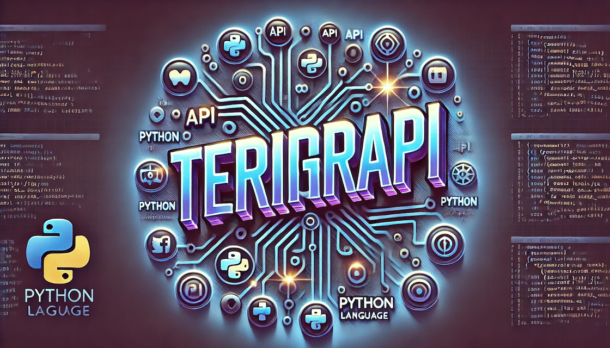

<meta property="og:image" content="assets/banner-mini.png">



# terigrapi - Asynchronous Instagram API for Python

**terigrapi** is an asynchronous Python client for the Instagram API, heavily inspired by the original [aiograpi](https://github.com/subzeroid/aiograpi) library. While aiograpi served as the foundation, terigrapi improves upon it by restructuring all methods using classes, enhancing type definitions to ensure complete and accurate results, and setting the stage for a more robust and maintainable codebase.

> **Note:** This project is still under development. Currently, only parts of the login functionality and a section related to Direct messaging have been completed.

### Installation

To install terigrapi, clone the repository and run:

```bash
pip install .
```

### Basic Usage

```python
from terigrapi import Client

cl = Client()
await cl.login(ACCOUNT_USERNAME, ACCOUNT_PASSWORD)

direct = await cl.direct_threads()
```

### Checkpoints

**Completed:**
- Refactored structure to use class-based methods.
- Enhanced type definitions to provide full, untruncated results.
- Implemented login functionality (partial).
- Developed a section for Direct messaging (partial).

**To-Do:**
- Complete the remaining login functionality.
- Extend Direct messaging capabilities.
- Implement media upload/download features.
- Add support for handling user data (followers, following, etc.).
- Develop insights and analytics functionalities.
- Add challenge resolver (e.g., Email and SMS handlers).
- Thoroughly test and refine the existing codebase.

### Contributing

Contributions are welcome! Please submit issues and pull requests via the [GitHub repository](https://github.com/yourusername/terigrapi).
